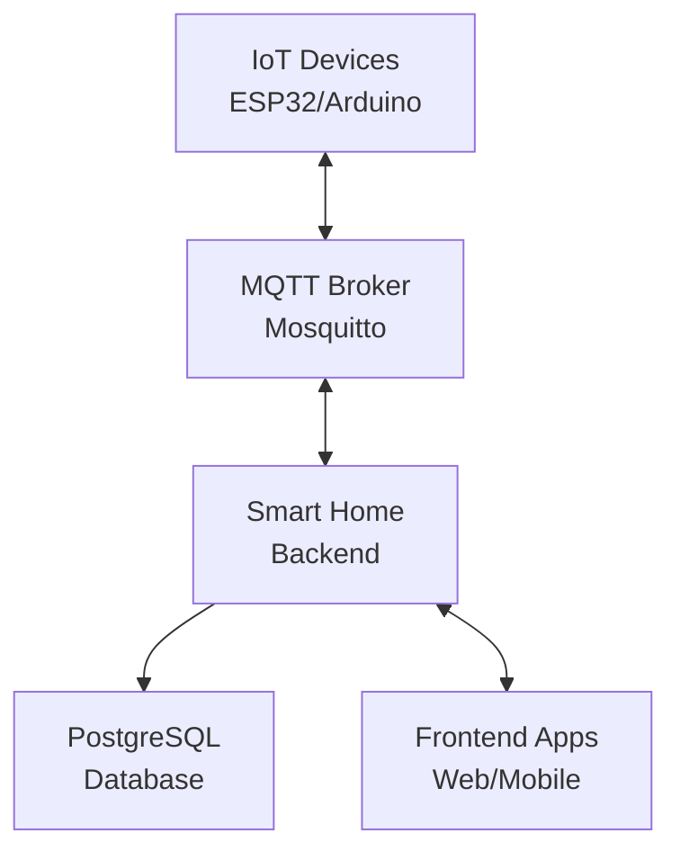

# Smart Home Backend

[](https://www.typescriptlang.org/)
[](https://bun.sh/)
[](https://hono.dev/)
[](https://www.postgresql.org/)
[](https://www.prisma.io/)

Production-ready IoT backend with AI-powered analytics, real-time MQTT communication, and comprehensive device management for smart home systems.

## 🌟 Features

### 🔌 **Real-time IoT Communication**

- MQTT-based device communication with Mosquitto broker
- WebSocket real-time updates for frontend clients
- Device authentication and authorization
- Automatic device discovery and pairing

### 🤖 **AI-Powered Analytics**

- Energy consumption prediction with multiple ML algorithms
- Real-time anomaly detection for sensors and equipment
- Intelligent insights and recommendations
- Model performance tracking and optimization

### 🏠 **Smart Home Management**

- Multi-home support with role-based access control
- Room and device organization
- Device configuration management
- Real-time monitoring and control

### 🚨 **Intelligent Alerting**

- Customizable alarm thresholds
- Multi-channel notifications (Email, SMS, Push)
- Automatic escalation and acknowledgment
- Historical alarm tracking and analytics

### 🔄 **OTA Firmware Updates**

- Over-the-air device updates
- Version management and rollback support
- Batch deployment capabilities
- Update progress tracking

### 🔒 **Enterprise Security**

- JWT-based authentication with refresh tokens
- Role-based access control (ADMIN, MEMBER, VIEWER)
- Device-specific authentication tokens
- Comprehensive audit logging

## 🚀 Quick Start

### Prerequisites

- **Bun** 1.0+ (recommended) or **Node.js** 18+
- **PostgreSQL** 14+
- **Docker & Docker Compose** (for development)
- **Git**

### Development Setup

```bash
# Clone repository
git clone <repository-url>
cd smarthome-backend

# Install dependencies
bun install

# Setup environment
cp .env.example .env
# Edit .env with your configuration

# Start services with Docker
docker-compose up -d

# Run database migrations
bun run prisma:migrate
bun run prisma:generate

# Build Tailwind CSS
bun run tailwind:build

# Start development server
bun run dev
```

### Access Points

- **Landing Page**: <http://localhost:3000/>
- **API Documentation**: <http://localhost:3000/docs>
- **OpenAPI Spec**: <http://localhost:3000/openapi.json>
- **AsyncAPI Spec**: <http://localhost:3000/docs/asyncapi.yaml>
- **Health Check**: <http://localhost:3000/health>

## 📚 Documentation

### 📖 **Complete Documentation**

- [📋 Project Overview](./docs/README.md) - Comprehensive project documentation
- [🔧 Development Guide](./docs/DEVELOPMENT_GUIDE.md) - Setup, coding standards, and workflow
- [🚀 Deployment Guide](./docs/DEPLOYMENT_GUIDE.md) - Production deployment instructions

### 🔌 **API & Integration**

- [📖 API Reference](./docs/API_REFERENCE.md) - Complete REST API documentation
- [🔌 MQTT Integration](./docs/MQTT_INTEGRATION.md) - Real-time IoT device communication
- [📊 AsyncAPI Specification](./docs/asyncapi.yaml) - MQTT topic contracts

### 🤖 **AI & Performance**

- [🧠 AI System Guide](./docs/AI_SYSTEM.md) - Energy prediction and anomaly detection
- [⚡ Schema Optimization](./docs/SCHEMA_OPTIMIZATION.md) - Database performance improvements

## 🏗️ Architecture



## 🔧 Tech Stack

### **Backend Core**

- **Runtime**: Bun (JavaScript runtime)
- **Framework**: Hono (lightweight web framework)
- **Database**: PostgreSQL with Prisma ORM
- **API Documentation**: OpenAPI 3.1 with Swagger UI
- **Real-time**: MQTT with Mosquitto broker

### **AI & Machine Learning**

- **Energy Prediction**: Moving Average, Linear Regression, Seasonal Decomposition
- **Anomaly Detection**: Statistical analysis and threshold monitoring
- **Model Management**: Performance tracking and automatic selection

### **Development & Deployment**

- **Language**: TypeScript with strict type checking
- **Validation**: Zod schemas for runtime type safety
- **Styling**: Tailwind CSS for UI components
- **Containerization**: Docker and Docker Compose
- **Testing**: Bun test with comprehensive coverage

## 📊 API Endpoints

### **Authentication**

```http
POST /api/v1/auth/register    # Register new user
POST /api/v1/auth/login       # User login
POST /api/v1/auth/refresh     # Refresh JWT token
```

### **Home Management**

```http
GET    /api/v1/homes                    # List user homes
POST   /api/v1/homes                    # Create new home
GET    /api/v1/homes/{id}               # Get home details
PATCH  /api/v1/homes/{id}               # Update home
DELETE /api/v1/homes/{id}               # Delete home
```

### **Device Management**

```http
GET    /api/v1/homes/{homeId}/devices   # List home devices
POST   /api/v1/homes/{homeId}/devices   # Register new device
GET    /api/v1/devices/{id}             # Get device details
PATCH  /api/v1/devices/{id}             # Update device
DELETE /api/v1/devices/{id}             # Delete device
```

### **Telemetry & Control**

```http
POST /api/v1/devices/{id}/telemetry     # Send sensor data
GET  /api/v1/devices/{id}/telemetry     # Get telemetry history
POST /api/v1/devices/{id}/commands      # Send device command
GET  /api/v1/commands/{id}              # Get command status
```

### **AI & Analytics**

```http
POST /api/v1/devices/{id}/energy-predictions  # Generate energy prediction
GET  /api/v1/devices/{id}/ai-insights          # Get AI insights
POST /api/v1/predictions/{id}/anomalies        # Detect anomalies
GET  /api/v1/ai-models                         # List AI models
```

## 🔌 MQTT Topics

### **MQTT Communication**

```text
smarthome/{homeId}/{deviceId}/telemetry    # Sensor data from devices
smarthome/{homeId}/{deviceId}/status       # Device online/offline status
smarthome/{homeId}/{deviceId}/heartbeat    # Periodic health checks
smarthome/{homeId}/{deviceId}/commands     # Control commands to devices
smarthome/{homeId}/{deviceId}/config       # Configuration updates
```

### **Message Examples**

**Telemetry Data:**

```json
{
  "timestamp": "2026-02-13T12:00:00.000Z",
  "deviceId": "ESP32_001",
  "current": 0.72,
  "gasPpm": 450,
  "flame": false,
  "binLevel": 35.5,
  "powerW": 120.5,
  "voltageV": 220.3,
  "currentA": 0.55
}
```

**Device Command:**

```json
{
  "commandId": "cmd_123456789",
  "timestamp": "2026-02-13T12:00:00.000Z",
  "type": "SET_POWER",
  "payload": {
    "power": true,
    "brightness": 80
  },
  "source": "USER"
}
```

## 🧪 Testing

```bash
# Run all tests
bun test

# Run specific test suite
bun test tests/services/

# Run with coverage
bun test --coverage

# Run in watch mode
bun test --watch
```

## 🚀 Deployment

### **Docker Production**

```bash
# Build and start production services
docker-compose -f docker-compose.prod.yml up -d --build

# Run database migrations
docker-compose -f docker-compose.prod.yml exec api bun run prisma:migrate
```

### **Manual Deployment**

```bash
# Build for production
bun run build

# Start production server
bun run start
```

See the [Deployment Guide](./docs/DEPLOYMENT_GUIDE.md) for detailed production deployment instructions.

## 🤝 Contributing

We welcome contributions! Please see our [Development Guide](./docs/DEVELOPMENT_GUIDE.md) for:

- Development setup and workflow
- Coding standards and best practices
- Testing guidelines
- Pull request process

### **Quick Contribution Steps**

1. Fork the repository
2. Create a feature branch (`git checkout -b feature/amazing-feature`)
3. Make your changes following our coding standards
4. Add tests for new functionality
5. Update documentation as needed
6. Submit a pull request

## 📈 Performance

### **Database Optimization**

- 60-90% query performance improvement with strategic indexing
- Efficient pagination and filtering
- Connection pooling and query optimization

### **Scalability**

- Horizontal scaling support with load balancers
- Database read replicas for high-traffic scenarios
- Redis caching for frequently accessed data
- CDN support for static assets

## 🔒 Security

- JWT-based stateless authentication
- Role-based access control (RBAC)
- Device-specific authentication tokens
- SQL injection prevention with Prisma
- Input validation with Zod schemas
- Rate limiting and CORS protection

## 📄 License

This project is licensed under the MIT License - see the [LICENSE](LICENSE) file for details.

## 🙏 Acknowledgments

- **Bun** - Fast JavaScript runtime and package manager
- **Hono** - Lightweight web framework for edge computing
- **Prisma** - Next-generation ORM for TypeScript
- **PostgreSQL** - Advanced open-source relational database
- **Mosquitto** - Lightweight MQTT broker

---

**Ready to build the future of smart homes?**

📖 Start with our [Development Guide](./docs/DEVELOPMENT_GUIDE.md) or explore the [API Documentation](http://localhost:3000/docs) to begin integrating with the Smart Home Backend.

For questions, issues, or contributions, please visit our [GitHub repository](https://github.com/your-repo) or check out the [comprehensive documentation](./docs/README.md).
